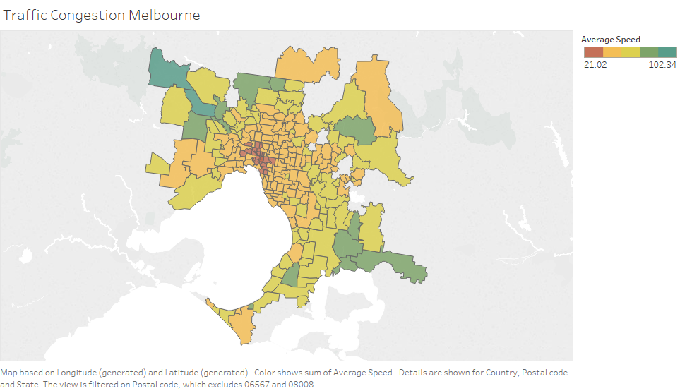

The splitted car speeds data is transformed for suburb ranking by speed.

```{r}

library(readr)
carspeeds<- read_csv("C:/Sem3/LEP/LEp R/carspeeds_tab.csv")
head(carspeeds)
```


```{r message=FALSE, warning=FALSE}
library(tidyr) 
library(dplyr)
```

Group by postal code and get the summary statistics

```{r}

carspeeds_suburbs <- group_by(carspeeds, carspeeds$`Postal code`)
summary_table <- summarise(carspeeds_suburbs, average_speed=mean(Speed), stdev_speed=sd(Speed))
```

```{r}
summary_table
```

order table by average speed
```{r}

summary_table <- summary_table[order(summary_table$average_speed),]
summary_table
```

Export data to tableau for visualisation

```{r}
write.csv(summary_table, file="Summary_data.csv")
```

Visualisation of summary table

```{r}

```


Top 10 Busiest Suburbs:

3001 - Melbourne
3000 - Melbourne CBD
3050 - Parkville
3053 - Carlton
3010 - Uiversity of Melbourne
3065 - Fitzroy
3066 - Collingwood
3051 - North Melbourne
3181 - Prahran
3056 - Brunswick


